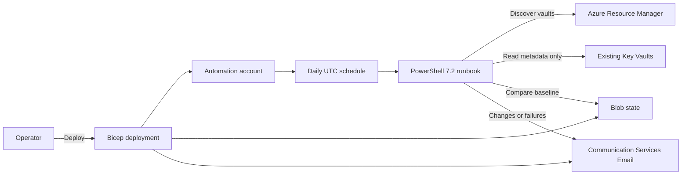

## Overview

This solution runs a daily Azure Automation job that discovers existing Key
Vault resources across selected subscriptions. It lists secret and certificate
metadata, compares each item with a Blob Storage baseline, and sends an email
through Azure Communication Services when an existing item changes or a scan
fails.

The runbook never requests secret values or private certificate material. The
deployment does not create Key Vaults. Unless explicitly skipped, the wrapper
updates legacy vault access policies only to grant metadata-list permissions.



## Disclaimer

This project is a personal, community sample provided as-is and as-available,
without warranty of any kind, express or implied. It is not an official
Microsoft product or a supported offering. No license is currently granted, so
all rights are reserved. Review, test, and validate the code in a
nonproduction environment before relying on it. Use at your own risk.

## Behavior

The monitor performs these steps on each run:

1. Discovers every Key Vault in each configured subscription.
2. Lists current secret and certificate metadata through the Key Vault REST API.
3. Compares update time, enabled state, validity dates, and certificate
   thumbprint with the previous snapshot.
4. Emails the configured recipient when an item is new, modified, or deleted,
   when an item nears or passes its expiration, or when any scan scope fails.
5. Writes the new metadata snapshot with Blob Storage ETag protection.

Each reported change carries a type: `New` for an item that appeared since the
last run, `Modified` for an existing item whose metadata changed, and `Deleted`
for an item that no longer exists. The first successful run establishes the
baseline and does not report items as changes. If a subscription, vault, or
object type cannot be scanned, the prior state for that scope is retained so a
transient failure is not misreported as a deletion.

Secrets and certificates with an expiration date trigger a reminder once they
fall within 30 days of expiring, and again no more than weekly until they are
renewed or removed. Items without an expiration date are never flagged. The
30-day threshold and weekly interval are the `ExpiryWarningThresholdDays` and
`ExpiryReminderIntervalDays` runbook parameters.

## Deployed resources

The Bicep deployment creates the following resources:

* A resource group and Blob Storage account for monitor state
* An Automation account with a system-assigned identity, unless you reuse one
* A PowerShell 7.2 runbook and daily UTC schedule
* Azure Communication Services Email resources, unless you reuse a service
* Reader and Key Vault Reader role assignments on each monitored subscription
* Metadata-list access policies on vaults that do not use Azure RBAC
* Blob data and email sender authorization for the Automation identity

The interactive wrapper publishes the local runbook content and creates the
runbook-to-schedule binding after the Bicep deployment completes.

## Prerequisites

Install or configure:

* PowerShell 7.2 or later
* Azure CLI with Bicep support
* Pester 5.5 or later and PSScriptAnalyzer for local validation
* Permission to create resources in the deployment scopes
* Permission to create role assignments in every monitored subscription
* Permission to create a custom role in the Communication Services subscription
* Permission to update access policies on legacy authorization-mode vaults

```powershell
az bicep install
Install-Module Pester -MinimumVersion 5.5.0 -Scope CurrentUser
Install-Module PSScriptAnalyzer -Scope CurrentUser
```

When you reuse an Automation account, it must have a system-assigned managed
identity. When you reuse Communication Services, it must already be linked to
an Email Communication Services domain, and you must provide a verified sender
address.

## Networking

The runbook runs on shared Azure Automation cloud infrastructure with dynamic
outbound IP addresses, so it cannot be allowed through a firewall by IP address
or service tag. Plan network access for its two dependencies accordingly.

### State storage account

The deployment keeps the state storage account reachable but locked to the
Automation account: `publicNetworkAccess` stays `Enabled`, the firewall default
action is `Deny`, and a resource instance rule grants only this solution's
Automation account. No other caller reaches the account, so this is not open
public access. If a Secure Future Initiative or similar policy forces
`publicNetworkAccess` to `Disabled`, supply an exemption through the
`-StateStoragePolicyExemptionTags` deployment parameter so the account keeps its
resource-scoped public endpoint.

### Monitored Key Vaults

The runbook reads each vault's data plane directly. Key Vault has no
resource-instance rule, and the Automation sandbox is not a trusted service, so
each vault must permit the scan through its own firewall. A vault whose public
access is disabled, or whose firewall excludes the sandbox, returns an HTTP 403
that the run records as a scan failure and never mistakes for a deletion. A
fully private vault requires a Hybrid Runbook Worker with private-endpoint
access, which this solution does not deploy.

## Deploy interactively

Sign in and run the deployment wrapper:

```powershell
az login
./scripts/Deploy-Solution.ps1
```

The wrapper prompts for the deployment subscription, Azure region, resource
group, notification recipient, monitored subscriptions, and optional existing
resource details. Press Enter at the monitored-subscription prompt to scan all
enabled subscriptions visible to the current Azure CLI identity. Choose not to
reuse a resource to create a new one.

When you answer yes to reusing Azure Communication Services, the wrapper also
prompts for the **verified sender email address**. Enter the sender address that
belongs to a domain linked to that Communication Services resource, for example
`DoNotReply@<your-managed-domain>.azurecomm.net`. A mailbox address whose domain
is not linked to the resource causes the runbook email send to fail.

The daily schedule starts about 15 minutes after deployment. Re-running the
wrapper updates the runbook and replaces only this solution's matching schedule
binding.

## Deploy noninteractively

Omitting existing resource parameters creates both an Automation account and
Communication Services Email resources:

```powershell
./scripts/Deploy-Solution.ps1 `
    -NonInteractive `
    -DeploymentSubscriptionId '00000000-0000-0000-0000-000000000000' `
    -Location 'eastus2' `
    -ResourceGroupName 'rg-keyvault-change-monitor' `
    -NotificationRecipient 'keyvault-operator@contoso.com'
```

Pass `-MonitoredSubscriptionIds` to restrict the scan. To reuse resources,
provide the corresponding name, resource group, subscription ID, and verified
sender parameters exposed by `Get-Help ./scripts/Deploy-Solution.ps1 -Full`.
Use `-SkipLegacyAccessPolicies` only when metadata-list permissions for the
Automation identity are provisioned through another process.

## Reuse existing Communication Services

To send notifications through an existing Azure Communication Services resource,
provide its name, resource group, subscription, and the verified sender address.
Supply the sender address with `-ExistingCommunicationServiceSenderAddress`:

```powershell
./scripts/Deploy-Solution.ps1 `
    -NonInteractive `
    -DeploymentSubscriptionId '00000000-0000-0000-0000-000000000000' `
    -Location 'eastus2' `
    -ResourceGroupName 'rg-keyvault-change-monitor' `
    -NotificationRecipient 'keyvault-operator@contoso.com' `
    -ExistingCommunicationServiceName 'acs-notifications' `
    -ExistingCommunicationServiceResourceGroupName 'rg-notifications' `
    -ExistingCommunicationServiceSubscriptionId '00000000-0000-0000-0000-000000000000' `
    -ExistingCommunicationServiceSenderAddress 'DoNotReply@<your-managed-domain>.azurecomm.net'
```

The sender address domain must be linked to the reused Communication Services
resource. Find a valid sender under the resource's linked email domain, where the
Azure-managed domain provides a `DoNotReply` sender by default. In interactive
mode, the wrapper prompts for this address after you choose to reuse the service.

## Validate locally

Run all local checks:

```powershell
npm run validate
```

## References

* [Azure Automation runbooks](https://learn.microsoft.com/azure/automation/automation-runbook-types)
* [Azure Communication Services Email](https://learn.microsoft.com/azure/communication-services/concepts/email/email-overview)
* [Azure Key Vault security](https://learn.microsoft.com/azure/key-vault/general/security-features)
* [Managed identities for Azure resources](https://learn.microsoft.com/entra/identity/managed-identities-azure-resources/overview)
